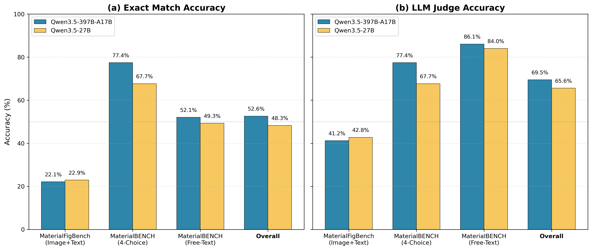

# Material Bench

Material science ベンチマーク（MaterialFigBench, MaterialBENCH）の推論・評価スクリプト

## 概要

| データセット | 形式 | 問題数 |
|---|---|---|
| **MaterialFigBench** | 画像＋テキスト（マルチモーダル） | 137 問 |
| **MaterialBENCH choice** | 4 択問題 | 164 問 |
| **MaterialBENCH free** | 自由記述問題 | 144 問 |

OpenAI 互換 API（vLLM など）を使用して推論・評価を実行します。

## インストール

```bash
pixi install
```

## 使い方

```bash
# 単一データセットを実行
pixi run python scripts/run_benchmark.py \
  --dataset materialbench-choice \
  --api-base http://localhost:8001

# 全データセットを実行
pixi run python scripts/run_benchmark.py \
  --dataset all \
  --api-base http://localhost:8001

# LLM judge 付きで実行
pixi run python scripts/run_benchmark.py \
  --dataset materialbench-free \
  --api-base http://localhost:8001 \
  --use-llm-judge

# 既存の CSV 結果に LLM judge のみ適用
pixi run python scripts/run_benchmark.py \
  --llm-judge-only \
  --dataset materialbench-free \
  --api-base http://localhost:8001
```

### 主なオプション

| オプション | 説明 | デフォルト |
|-----------|------|-----------|
| `--dataset` | 対象データセット（material-figbench / materialbench-choice / materialbench-free / all） | 必須 |
| `--api-base` | OpenAI 互換 API ベース URL | `http://localhost:8001` |
| `--model` | モデル名 | `Qwen/Qwen3.5-397B-A17B-FP8` |
| `--output-dir` | 結果保存ディレクトリ | `./results` |
| `--num-threads` | 並列スレッド数 | `1` |
| `--max-samples` | サンプル数上限（0 で全体） | `0` |
| `--use-llm-judge` | 推論後に LLM 評価を実行 | `False` |
| `--llm-judge-only` | 既存 CSV に LLM 評価のみ適用 | `False` |
| `--judge-csv` | LLM 評価する CSV ファイル | `None` |
| `--judge-api-base` | LLM judge 用 API ベース URL | `--api-base` と同じ |
| `--judge-model` | LLM judge 用モデル名 | `--model` と同じ |
| `--judge-num-threads` | LLM judge の並列スレッド数 | `--num-threads` と同じ |

### 出力ファイル

```
results/
├── {dataset}_YYYYMMDD_HHMMSS.csv   # 推論結果
├── summary_YYYYMMDD_HHMMSS.json    # 評価サマリー
└── *_judged.csv                    # LLM judge 結果
```

CSV には `question_id`, `prediction`, `correct` 等のカラムが含まれます。`--use-llm-judge` 使用時は `llm_judge_correct`, `llm_judge_reason` も追加されます。

## ベンチマーク結果



### 正解率（完全一致）

| モデル | FigBench | Choice | Free | Overall |
|--------|----------|--------|------|---------|
| Qwen3.5-397B-A17B | 22.14% (29/131) | 77.44% (127/164) | 52.08% (75/144) | 52.62% (231/439) |
| Qwen3.5-27B | 22.90% (30/131) | 67.68% (111/164) | 49.31% (71/144) | 48.29% (212/439) |

### LLM Judgeによる正解率（意味的一致）

 - `--judge-model = "Qwen/Qwen3.5-397B-A17B-FP8"`

| モデル | FigBench | Choice | Free | Overall |
|--------|----------|--------|------|---------|
| Qwen3.5-397B-A17B | 41.22% (54/131) | 77.44% (127/164) | 86.11% (124/144) | 69.48% (305/439) |
| Qwen3.5-27B | 42.75% (56/131) | 67.68% (111/164) | 84.03% (121/144) | 65.60% (288/439) |

## データソース

- [MaterialBENCH](https://huggingface.co/datasets/omron-sinicx/MaterialBENCH)
- [MaterialFigBench](https://huggingface.co/datasets/omron-sinicx/MaterialFigBench)

## ライセンス

MIT
